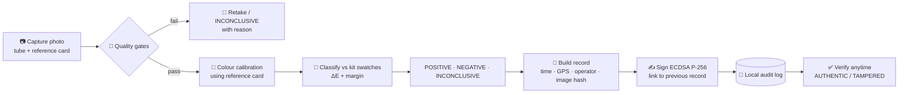
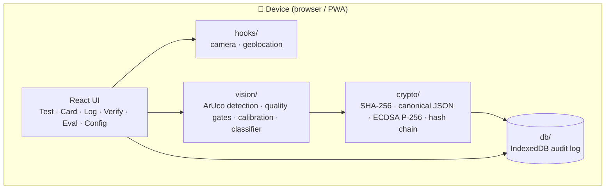

<div align="center">

# 🛡️ SATOPA

### Verifiable field-test records for colorimetric drug-test kits

**Read it. Sign it. Prove it.**

</div>

> ⚠️ **SATOPA produces a *presumptive* field-test result and a supporting digital record. It does not replace laboratory confirmatory testing.**

---

## 📌 The problem

Field drug-testing kits depend on a person looking at a colour change and deciding what it means.

- **Subjective:** two officers can read the same tube differently, and lighting changes what the colour looks like.
- **Not standardised:** there is no common reference for what "purple" or "orange-brown" is.
- **No proof:** nothing shows a test was actually done at a given place and time, so field results can't be relied on as documentary evidence.

## 💡 Our solution

SATOPA is a mobile-first web app (PWA) that works **alongside the kits already in use, with no new hardware**. A printed reference colour card goes in the frame with the test tube. The app then:

1. **Captures** the result with the phone camera and checks the photo is good enough.
2. **Calibrates** for lighting using the reference card.
3. **Classifies** the result as `POSITIVE`, `NEGATIVE` or `INCONCLUSIVE`, and shows its reasoning.
4. **Signs** a tamper-evident record: timestamp, GPS, operator ID and a cryptographic hash of the image.
5. **Logs** every test in a searchable, hash-chained audit log.
6. **Verifies** any record independently, so anyone can check it hasn't been altered.

---

## ✨ Features

| | Feature | What it does |
|---|---|---|
| 📷 | **Guided capture** | Camera capture with gallery upload fallback; a printable A6 reference card with four ArUco corner markers |
| 🚦 | **Automatic quality gates** | Checks reference card lock (4/4 markers), sharpness, camera tilt, exposure, glare and lighting uniformity, and asks for a retake if any fail |
| 🎨 | **Lighting-calibrated classification** | Corrects colours against the reference card, then compares the sample to kit reference swatches by colour distance (ΔE) |
| 🤔 | **Honest abstention** | Returns `INCONCLUSIVE` with a written rationale when the photo is poor or the colour is ambiguous, instead of guessing |
| 🔏 | **Signed digital record** | SHA-256 of the image, ECDSA P-256 signature, timestamp, GPS (with accuracy) and operator ID, plus a QR code |
| ⛓️ | **Hash-chained log** | Each record links to the previous one; the log shows "Chain intact" or exactly where it broke |
| 🔍 | **Searchable audit log** | Search by case reference, operator, lot or UUID; filter by result; export CSV |
| ✅ | **Independent verification** | Re-checks every record layer by layer and reports **AUTHENTIC** or **TAMPERED**; supports uploaded external `record.json` |
| 📄 | **PDF evidence report** | Printable summary of a record with image, result, hashes and disclaimer |
| 📴 | **Offline-first** | Works without a network; records are stored on the device |
| 📊 | **Evaluation suite** | Benchmarks accuracy with vs without card calibration across lighting conditions |
| ⚙️ | **Configurable kits** | Kit type, lot number, expiry, acceptance threshold and separation margin are configurable |

---

## 🔄 How it works



### 1. Quality gates

Before any result is produced, the photo must pass:

| Gate | Requirement |
|---|---|
| Reference card | All 4 ArUco corner markers detected |
| Sharpness | Laplacian variance ≥ 80 |
| Camera tilt | ≤ 20° |
| Exposure | Average luma within 35 to 230 |
| Specular glare | ≤ 4% of pixels clipped |
| Illumination uniformity | Low variance across the card |

If a gate fails, SATOPA says which one and why, and does **not** output a result.

### 2. Calibration and classification

- The card is perspective-corrected, and its known colour patches (white, grey, black, red, green, blue, cyan, magenta, yellow) are used to fit a least-squares colour normalisation, removing the tint of the room's lighting.
- The sample colour is compared with the selected kit's reference swatches. A result is accepted only if the best match is within the **acceptance threshold** and clearly ahead of the runner-up (the **separation margin**). Otherwise the outcome is `INCONCLUSIVE`.
- The default kit profile is a **Marquis-style reagent** (`defaultKits`). Kit profiles are data, so new reagents can be added without code changes.

### 3. Tamper-evident record

Each test produces a record containing:

```jsonc
{
  "recordId": "uuid",
  "caseRef": "CASE-2026-0512",
  "operatorId": "OP-8841",
  "deviceId": "DEV-…",
  "timestamp": "2026-09-29T17:16:51Z",
  "gps": { "lat": 0, "lng": 0, "accuracyM": 0 },   // or "GPS unavailable"
  "kit": { "name": "Marquis", "lot": "MQ-2026-X04" },
  "result": "NEGATIVE",
  "confidence": 0.96,
  "imageSha256": "…",
  "previousRecordHash": "…",
  "recordHash": "…",
  "signature": "ECDSA-P256 …",
  "publicKey": "…"
}
```

### 4. Four-layer verification

| Layer | Check |
|---|---|
| 1 | **Image integrity:** SHA-256 of the stored image matches the record |
| 2 | **Signature:** the ECDSA P-256 signature is valid for the record contents |
| 3 | **Chain continuity:** the record correctly links to the previous record |
| 4 | **Time and GPS sanity:** timestamp and location are plausible |

Change any field or the image and at least one layer fails, so the record shows **TAMPERED** and the verifier says which layer failed.

---

## 🏗️ Architecture



Everything runs on the device. No image or record leaves the phone unless the operator exports it, which makes the app usable in places with no connectivity.

### Project structure

```
src/
├── components/   UI: camera capture, quality gates, classification result,
│                 audit log, verification, PDF evidence, printable card, evaluation
├── crypto/       hashing, signing and verification (recordCrypto.ts)
├── data/         kit profiles, demo card generator, sample data seeding
├── db/           IndexedDB persistence for the audit log
├── hooks/        camera and geolocation hooks
├── tests/        unit and flow tests (crypto, classifier, hash chain, tamper, demo flow)
├── types/        shared TypeScript types
├── utils/        QR code and helpers
└── vision/       ArUco detection, quality checks, calibration, classification
public/
└── dataset/      surrogate evaluation dataset (see below)
```

---

## 🚀 Quick start

```bash
git clone https://github.com/Adithi20122004/SATOPA.git
cd SATOPA
npm install
npm run dev        # http://localhost:5173
```

```bash
npm test           # run the test suite
npm run build      # type-check and production build
```

> 📍 **Camera and GPS require HTTPS or `localhost`.** Open the deployed link on your phone, or use `localhost` on a laptop.

### Try it in 2 minutes

1. Open **Card**, then print the A6 calibration card (or download the PNG).
2. Open **Config** and turn on **Sandbox mode**, then choose **Load sample data** to fill the log with signed sample records.
3. Open **Test** and capture a photo, or use **Upload Photo** with an image from `public/dataset/`.
4. Open **Log** to search records, and **Verify** to check one → `AUTHENTIC`.
5. In **Verify**, use **Simulate tampering** → `TAMPERED`, with the failing layer highlighted.
6. Open **Eval** and choose **Run benchmark** to see accuracy with vs without card calibration.

---

## 📊 Evaluation

The **Eval** tab runs the real classifier on a **surrogate dataset of 200+ simulated test images** across four lighting regimes (D65 daylight, 3000 K warm tungsten, cool fluorescent, dim/underexposed), with and without reference-card calibration. It reports accuracy per lighting condition, a confusion matrix, and how often the app correctly refuses poor-quality images.

> **Honest scope note.** The dataset is **synthetic**. Reaction colours are hand-picked approximations of a Marquis-style reagent, **not** measurements from real seized-drug tests. The results show how well calibration handles lighting, **not** forensic accuracy. Validation on real kit outcomes with laboratory partners is planned future work. See [`public/dataset/README.md`](public/dataset/README.md) for how the images are generated.

---

## 🔐 Security model

| Property | How |
|---|---|
| **Integrity of the image** | SHA-256 of the captured image is stored in the signed record |
| **Authenticity of the record** | ECDSA P-256 signature over a canonical (stable-key-order) JSON of the record |
| **Ordering and completeness** | Each record embeds the previous record's hash; deleting or editing a record breaks the chain |
| **Independent verification** | The public key travels with the record, so anyone can verify without trusting the app |
| **Privacy** | Operator IDs are pseudonymous; data stays on the device unless exported |

### Known limitations (stated openly)

- **GPS and device time can be spoofed** on a phone. SATOPA records GPS accuracy and runs a plausibility check, but a trusted server timestamp or device attestation is needed for court-grade assurance.
- **Signing keys live on the device.** Production would use hardware-backed keys and officer enrolment.
- **Lighting and camera variation** can still degrade results, which is why poor photos are rejected rather than guessed.
- **Presumptive only.** Results must be confirmed by a laboratory.

---

## 🧰 Tech stack

React · TypeScript · Vite · Tailwind CSS · Web Crypto API (SHA-256, ECDSA P-256) · IndexedDB · PWA / service worker · ArUco marker detection · Vercel

<div align="center">
<sub>SATOPA is a presumptive-result tool. It does not replace laboratory confirmatory testing.</sub>
</div>